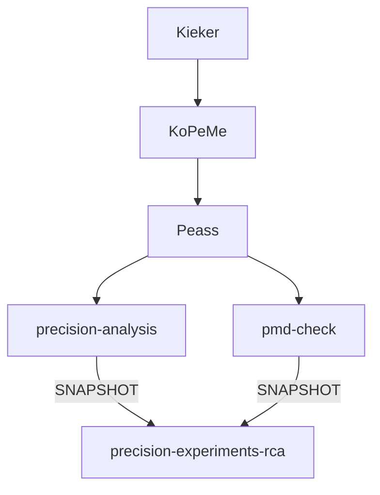
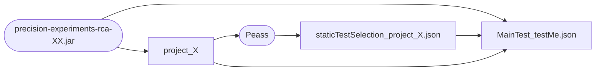

Precision Experiment RCA
===================== 

The goal of this project is to determine a measurement method which is capable of finding the root cause of a performance change using root cause analysis (RCA). The root cause of a performance change is the set of methods which cause the performance change. RCA is the process of identifying a root cause using measurement. With this project, you can define an performance change size and use experiments in order to determine how many vm starts and executions are needed to identify the root causes of a change.

The performance changes currently can be used for an addition and RAM workloads. Other workloads could be added.

# Before all tests

To be able to use all measurement methods, JDK 11 or above needs to be installed. The following graph shows the dependency tree of precision-experiments-rca

As the graph shows, Kieker, KoPeMe and Peass are included as release versions; precision-analysis and pmd-check are included as Snapshots. Therefore, they have to be installed in the local maven repo:
- precision-experiments: `git clone -b develop https://github.com/DaGeRe/precision-experiments.git && cd precision-experiments/precision-analysis/ && ../gradlew publishToMavenLocal`
- pmd-check: `git clone https://github.com/DaGeRe/pmd-check.git && cd pmd-check/analysis && ./mvnw clean install`

Afterwards, just run `./mvnw clean install` in the current folder.

# Test Execution

The following experiment types may be executed:
- examiniation of the measurement overhead for probes in an call tree containing only of single nodes
- execution of root cause analysis for given RCA strategies and configurations
These will be described in the following.

## Overhead Examination

When measuring the performance of single methods, these need to be instrumented (sampling-based techniques are not considered here). This instrumentation causes performance overhead. Additionally, the measurement itself causes overhead if it is activated (if Kiekers adaptive instrumentation feature is used, instrumentation may be activated and deactivated at runtime). It is possibe to instrument using AspectJ or to instrument using peass source instrumentation. The measurement may be done using Kieker's `OperationexecutionRecord` or the `DurationRecord`, which omits every information of the original record except start time, end time and method name (potentially increasing performance). Furthermore, as a baseline, measurement may be done with no instrumentation at all.

This is done using three steps:
- Generating a demo project, using `java -jar target/precision-experiments-rca-0.1-SNAPSHOT.jar` (`--treeDepth` can configure amount of call tree node levels, 3 by default)
- Generating a test specification file, using `java -jar $PEASS_PROJECT/starter/target/peass-starter-0.3.11-SNAPSHOT.jar select -folder target/project_3/` (to be saved in `staticTestSelection_project_X.json`)
- Executing the real measurement, using `java -cp target/precision-experiments-rca-0.1-SNAPSHOT.jar de.dagere.peass.validate_rca.measurement.RunSomeNodeMeasurement -folder target/project_3/ --nodeCount=3 --staticSelectionFile=results/staticTestSelection_project_3.json --repetitions=1000`

This is summarized in the following graph:

After successfull execution of the experiment, the easiest way to get the resulting data is `cat target/project_3_peass/measurementsFull/MainTest_testMe.json | grep value | awk '{print $NF}' | tr -d ","`. Afterwards they can be plotted etc.

## RCA Strategy and Configuration

Methods need to be distinguishable by their signature. If recursion occurs or equal methods are called in different parts of the tree, the measurements need to be distinguished or it needs to be asures that the performance of their respective executions is equal. This could be done by measuring the parents method as well and taking the position in the tree into account to distinguish methods. 

The performance of respective method execution needs to be gaussian distributed. 

It is assumed that only one method changed its performance (and possibly method calling these method). If two methods change their performance and the effects of the change overlay, different effects may happen.

