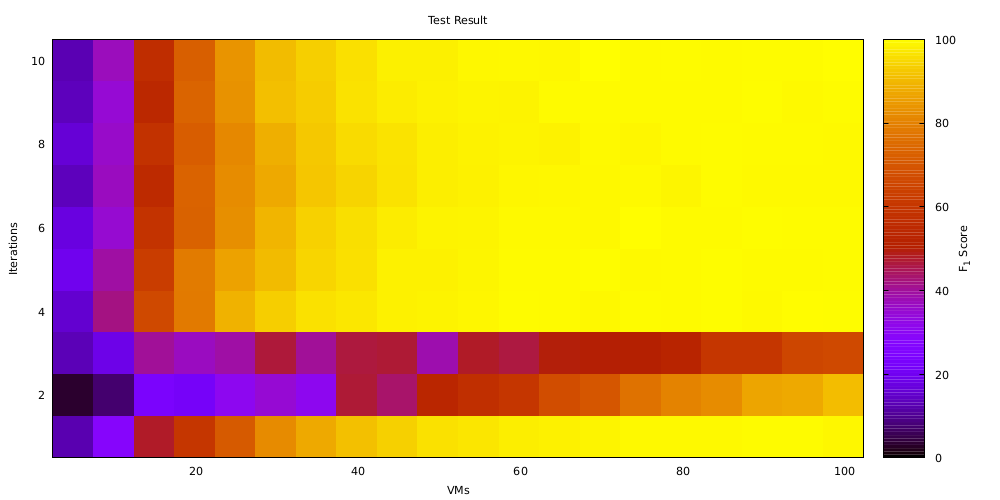

Precision Experiment RCA
===================== 

The goal of this project is to determine a measurement method which is capable of finding the root cause of a performance change using root cause analysis (RCA). The root cause of a performance change is the set of methods which cause the performance change. RCA is the process of identifying a root cause using measurement. With this project, you can define an performance change size and use experiments in order to determine how many vm starts and executions are needed to identify the root causes of a change.

The performance changes currently can be used for an addition and RAM workloads. Other workloads could be added.

# Before all tests

To be able to use all measurement methods, JDK 11 or above needs to be installed. The following graph shows the dependency tree of precision-experiments-rca

As the graph shows, Kieker, KoPeMe and Peass are included as release versions; precision-analysis and pmd-check are included as Snapshots. Therefore, they have to be installed in the local maven repo:
- precision-experiments: `git clone -b develop https://github.com/DaGeRe/precision-experiments.git && cd precision-experiments/precision-analysis/ && ../gradlew publishToMavenLocal`
- pmd-check: `git clone https://github.com/DaGeRe/pmd-check.git && cd pmd-check/analysis && ./mvnw clean install`

Afterwards, just run `./mvnw clean install` in the current folder.

# Test Execution

The following experiment types may be executed:
- examiniation of the measurement overhead for probes in an call tree containing only of single nodes
- execution of root cause analysis for given RCA strategies and configurations
These will be described in the following.

## Overhead Examination

When measuring the performance of single methods, these need to be instrumented (sampling-based techniques are not considered here). This instrumentation causes performance overhead. Additionally, the measurement itself causes overhead if it is activated (if Kiekers adaptive instrumentation feature is used, instrumentation may be activated and deactivated at runtime). It is possibe to instrument using AspectJ or to instrument using peass source instrumentation. The measurement may be done using Kieker's `OperationexecutionRecord` or the `DurationRecord`, which omits every information of the original record except start time, end time and method name (potentially increasing performance). Furthermore, as a baseline, measurement may be done with no instrumentation at all.

This is done using three steps:
- Generating a demo project, using `java -jar target/precision-experiments-rca-0.1-SNAPSHOT.jar` (`--treeDepth` can configure amount of call tree node levels, 3 by default)
- Generating a test specification file, using `java -jar $PEASS_PROJECT/starter/target/peass-starter-*-SNAPSHOT.jar select -folder target/project_3/` (to be saved in `staticTestSelection_project_X.json`)
- Executing the real measurement, using `java -cp target/precision-experiments-rca-0.1-SNAPSHOT.jar de.dagere.peass.validate_rca.measurement.RunSomeNodeMeasurement -folder target/project_3/ --nodeCount=3 --staticSelectionFile=results/staticTestSelection_project_3.json --repetitions=1000`

This is summarized in the following graph:

After successfull execution of the experiment, the easiest way to get the resulting data is `cat target/project_3_peass/measurementsFull/MainTest_testMe.json | grep value | awk '{print $NF}' | tr -d ","`. Afterwards they can be plotted etc.

## RCA Strategy and Configuration

This step predicts how the RCA strategy and the RCA configuration (VMs, iterations, warmup, repetitions) influence the type 2 error of an root cause analysis. It is assumed that only one method changed its performance (and the performance of callers), which has a unique signature. If two methods change their performance and the effects of the change overlay (or a changed method cannot be easily identified, because what it is doing depends heavily on the call context), different effects may happen.

Testing an RCA strategy and configuration is done nearly as above:
- Generating a demo project, using `java -jar target/precision-experiments-rca-0.1-SNAPSHOT.jar` (`--treeDepth` can configure amount of call tree node levels, 3 by default)
- Generating a test specification file, using `java -jar $PEASS_PROJECT/starter/target/peass-starter-*-SNAPSHOT.jar select -folder target/project_3/` (to be saved in `staticTestSelection_project_X.json`)
- **It differs starting from here** Finally, a performance root cause analysis is done, executing both versions and determining which call tree nodes of both commits have performance changes, using `java -jar $PEASS_PROJECT/starter/target/peass-starter-*-SNAPSHOT.jar searchcause -folder target/project_X -test "de.dagere.peass.MainTest#testMe" -staticSelectionFile results/staticTestSelection_project_X.json -commit $COMMIT`. 
    * Note that the newer `$COMMIT` needs to be specified, and that performance changes with a depth of more than 6 are, given all technical circumstances we tried, are unmeasurable. 
    * The measurement can be configured using all configurations from https://github.com/DaGeRe/peass/blob/c448ea0bfea73170854c10d0ed68939737e15ff9/dependency/src/main/java/de/dagere/peass/config/MeasurementConfig.java#L24, for example `-vms 100 -repetitions 100000 -iterations 10` (Note that especially increasing `-vms` and `-iterations` makes sense, because a configuration should be selected that can detect the performance change **for sure**; afterwards, the analysis predicts which potentially smaller configuration would be able to detect the change as well). 
- To **analyze** the data (creating CSVs with type 2 errors), call `java -cp target/precision-experiments-rca-0.1-SNAPSHOT.jar de.dagere.peass.precision.rca.analyze.GenerateRCAPrecisionPlot --outlierRemoval -data target/project_X_peass`, wich creates a folder like `results_outlierRemoval` (or `results_noOutlierRemoval`, depending on whether `--outlierRemoval` was set.
- To **plot** the CSVs, go to and call `./plotAll.sh ../../target/ resultingGraphs` (where `../../target` is the **parent** folder of all results folders, and `resultingGraphs` is the folder where results are stored). This will create graphs like the following:

In this graph, light yellow marks 100% F1 score, and where it gets darker, the F1-score decreases, indicating that performance changes are either overlooked or detected falsely.  This graph indicates that roughly 50 VMs are necessary to detect the performance change safely, either with only one iteration (so before warmup) or with more than 4 iterations (after warmup). For 2 and 3 iterations, the performance change is not detectable (due to warmup).
